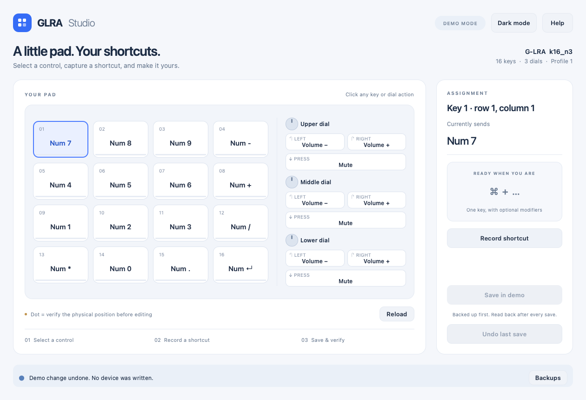
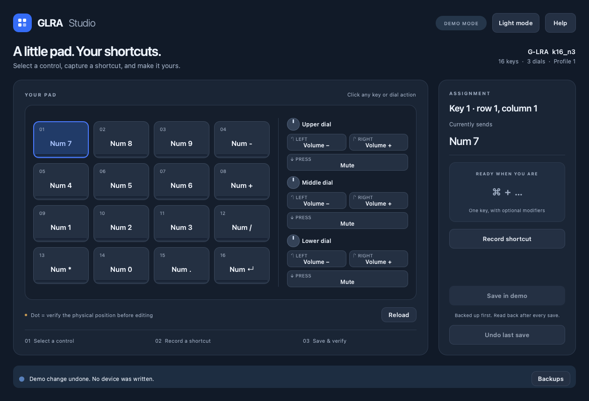

# GLRA Studio

**A little pad. Your shortcuts.**

A local, open-source macOS configurator for the **G-LRA k16_n3**: 16 keys,
three rotary encoders, and a web configurator that does not always work.
Built with Python 3.13, PySide6 and Qt Quick. No account, cloud service, or
manufacturer configuration software is required.



<details><summary>Dark mode</summary>



</details>

> **Early hardware-tested release.** Reading and individual assignments have
> been tested on one G-LRA k16_n3 firmware variant. Other pads are detected as
> candidates, not automatically enabled for writing. See [compatibility](#compatibility).

## What it does

- Detects a connected pad and displays all 16 key assignments and nine dial actions.
- Offers a light/dark interface and a completely offline demo mode.
- Detects a pad press while the app is active and offers to change that control.
- Records one keyboard key with optional Shift, Control, Option or Command modifiers.
- Saves the old assignments **before** writing, then verifies the changed data.
- Can undo the last successful save in the current device session.
- Guides you through verifying physical positions that have not yet been tested.

When several controls have the same assignment, their input reports are identical.
The app asks you to select the physical control instead of pretending it can tell
which one was used. Layout positions marked with a small dot require verification
before saving. Current labels at those positions are inferred from the layout.

## Get started

Requires **macOS 13 or later**, **Python 3.13**, and a USB data cable. Hardware
integration is currently macOS-only; the demo is suitable for experimenting
without a pad. Tested locally on Apple Silicon with Python 3.13.1.

Download the source ZIP or clone this repository:

```sh
git clone https://github.com/imolitor/glra-studio.git
cd glra-studio
python3.13 -m venv .venv
source .venv/bin/activate
python -m pip install -e .
glra-studio
```

After downloading/extracting the project, `Launch.command` is an alternative
launcher: it uses an existing environment or creates `.venv` and installs the
GUI dependencies on first launch. Python 3.13 must already be installed.
The first installation requires an internet connection; using the pad does not.

Try the interface without accessing **any** HID device:

```sh
glra-studio --demo
```

This release does not include a signed/notarized `.app` or a PyPI publication.
Install from this repository using the commands above.

## Allow input monitoring

To recognize pad presses, macOS may require:

**System Settings → Privacy & Security → Input Monitoring**

Enable the application that launches Python, usually **Terminal**, then fully
quit and reopen that application. If launched through another host app, that
app may need permission instead. Reading configuration can work even when
keyboard monitoring is unavailable; the UI explains this separately.

Do not use `sudo`. Close other configurators before editing. The pad remains a
normal keyboard: its existing shortcuts can still affect the foreground app.
The recorder captures a new shortcut only while its recording state is active.

## Change a key or dial action

1. Connect the pad. Its current assignments appear automatically.
2. Click a key/dial action, or press it on the pad while GLRA Studio is active.
3. If marked as unverified, choose **Verify this control** and follow the prompt.
4. Choose **Record shortcut**, then press the desired combination on your normal keyboard.
5. Review the preview and select **Save to pad**.
6. Test the physical control. **Undo last save** restores the previous assignment.

For a capital P, record **Shift + P**. A letter alone represents its physical
keyboard usage; the operating system's keyboard layout and Caps Lock affect the
resulting text. Right/left modifier distinctions are normalized when recording.
Escape cancels recording. Macro sequences, standalone modifier keys, and new
media-key assignments are not supported by the recorder yet. Existing custom
assignments are preserved and displayed as raw labels when not understood.

### Verify an inferred position

Verification is an explicit, temporary write test. The app backs up the target,
assigns an unused function key, then asks you to operate **only the selected
physical control**. On receiving the marker, it restores the original assignment
and unlocks that control for editing in the current connection session. The test
also restores after 90 seconds if no matching event arrives.

Keep the pad connected during the test. A recovery journal is saved before the
temporary change; after a disconnect or interrupted test, reconnect and use
**Restore test**. The app does not overwrite a value that changed externally.
The top-left key and all three upper-dial actions were physically verified during
development. The remaining positions require this check.

## Compatibility

| Hardware / state | Support |
|---|---|
| G-LRA k16_n3, USB `36ae:2475` | Detected; descriptors checked |
| Protocol version 1, internal PID `246d`, firmware value 100 | Tested for individual assignments |
| First profile / first layer | Editing enabled on the tested firmware |
| Other profiles | Displayed when active; editing disabled |
| Other G-LRA / `0816` devices | Listed as candidates; not enabled for writing |
| Different descriptors / firmware | Writing refused |

The GUI numbers profiles from 1; the protocol numbers them from 0. USB PID and
internal firmware PID differ on the tested unit. Appearance or a Temu product
name alone does not establish protocol compatibility.

**Persistence after power removal has not yet been independently tested.**
A successful save means the acknowledgement and immediate readback matched.
There are no reset, bootloader, firmware-update or bulk-write commands in the GUI.

## Backups and privacy

The GUI uses macOS's application-data directory, normally underneath
`~/Library/Application Support/GLRA Studio/`. Click **Backups** to open the exact
location. The source tree stays free of device data.

Each change creates private, checksummed JSON files. Existing backup files are
never overwritten. The writer reads all six known 576-byte assignment windows
twice before and after a write and expects **exactly one four-byte change**.
These windows are **not a complete EEPROM/firmware image**. Unknown memory
layout and unsupported firmware features are not claimed to be backed up.

Logs and backups can contain serial numbers and shortcut/macro data. Do not
attach them to public issues without reviewing/redacting them. Demo screenshots
use synthetic assignments. This project contains no telemetry or automatic upload.

## Diagnostic CLI

The separate CLI retains read-only diagnostics and offline inspection:

```sh
macropad list
macropad inspect
macropad status
macropad dump --out dumps/descriptor.json
macropad backup --out dumps/readable-data.json
macropad verify dumps/readable-data.json
macropad --help
```

CLI outputs default to the current directory; they are excluded by `.gitignore`.
Protocol reads require sending known read-request Output reports. They do not
change assignments. Raw Input/Output/Feature inspection and `learn-key` are also
available; the tested device declares no Feature reports.

## Development

```sh
python -m pip install -e '.[dev]'
ruff check .
ruff format --check .
QT_QPA_PLATFORM=offscreen QT_QUICK_BACKEND=software \
  python -m unittest discover -s tests -v
python -m build
```

The GUI and device I/O are separate. HID calls run serially on one worker thread.
Tests use fake devices to exercise backup-before-write, stale state, wrong
acknowledgements, unexpected readback, keyboard decoding and demo isolation.
They cannot replace testing a new firmware variant on real hardware.

See [protocol notes](docs/protocol.md), [contributing](CONTRIBUTING.md), and
[third-party notices](THIRD_PARTY_NOTICES.md).

## Why this exists

The manufacturer page recognized the tested pad but left its layout blank.
The inspected JavaScript allowed `36ae:2475` to connect, then tried to import a
missing `36ae_2475.json` layout. This motivated a local configurator and a documented,
conservative implementation of the observed protocol.

## License

Project source: [MIT](LICENSE). PySide6, Qt, HIDAPI and other dependencies keep
[their own licenses](THIRD_PARTY_NOTICES.md). This is an independent community project.
